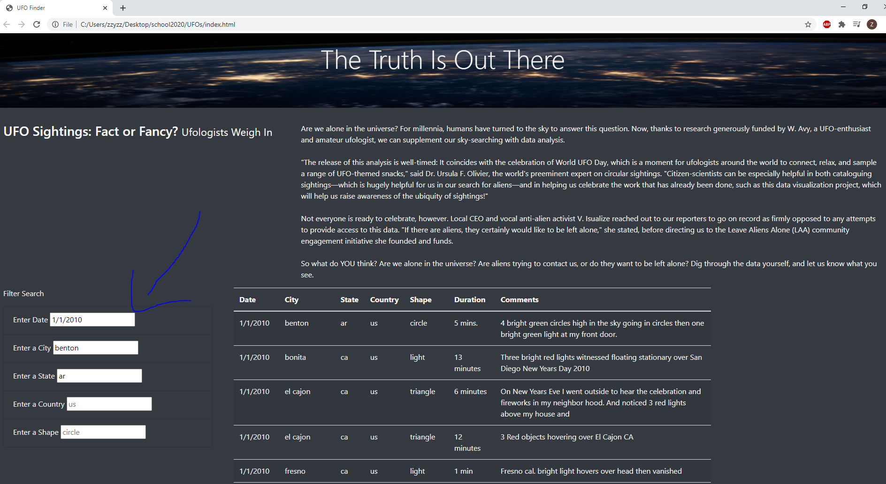

# UFOs

## Overview of project
The purpose of the project is to provide a more in-depth analysis of UFO sightings by allowing users to filter for multiple criteria at the same time with table filters for the city, state, country, and shape.

## Results
Someone may use the new webpage by inputing their desired filters on the left of the page using the search criterion to get the desired results as per below. 

##Summary

As a summary, one drawback of this new design is that there is no filter button to click when you are ready to filter for the desired data. Here are two recommendations for furhter development:
1. Add a filter button
2. Add a regular and dark mode for the page as it is currently only in dark mode. 

